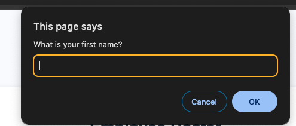

# Ben Parks Portfolio

## Description
This is a website that allows users to display employee names and salary information. It also logs information such as showing the average salary or picking a random employee.

## Purpose
This website was built to demonstrate proficiency in functions and loops. It was an introduction to JS logic challenge.

## Installation
No installation needed to view this website. Just to to https://benjamin-parks.github.io/Employee-Payroll-Tracker-Parks/ to view it. 

## Site Usage
To interact with this website, click into the add employees button and follow the directions on the prompts. Note that clicking cancel on the "Would you like to add another employee" prompt will exit you out and begin the table calculations. 

Inspecting the console on the webpage will also show information such as the average salary or a randomly selected employee. 

## Screenshots

